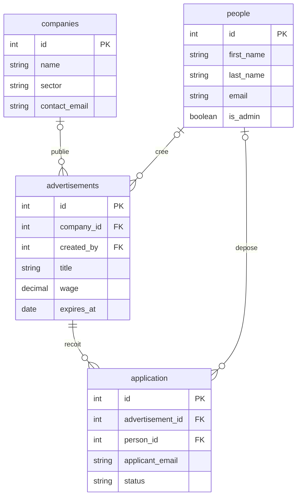

<div align="center">

# Humatch

**Job board pour connecter étudiants et entreprises**

`Python` `Flask` `SQLAlchemy` `MySQL` `JWT`

</div>

> **Contexte.** Projet scolaire d'équipe (Epitech, 2025). Ce dépôt reprend le backend et la base de données du projet ; l'interface web (HTML, CSS, JavaScript) n'y figure pas, et l'historique détaillé de l'équipe non plus.

## Ma contribution

- Corrections des scripts SQL (nom de la base, nom de la table dans les insertions de candidatures).
- Export de la base MySQL et organisation des fichiers de données.
- Organisation et versionnement des composants backend, dont le nettoyage des fichiers Python compilés.

Je ne me suis pas attribué l'API dans son ensemble ni l'interface.

## Ce que fait l'API

- Inscription et connexion par jeton JWT ; mots de passe hachés avec bcrypt.
- Gestion des entreprises et des annonces : création, consultation, modification, suppression.
- Dépôt de candidatures et suivi de leur statut (`received`, `in_review`, `rejected`, `accepted`).

## Contenu du dépôt

| Chemin | Rôle |
|:--|:--|
| `backend/api_python/` | API Flask : `app.py` (application et blueprints), configuration, modèles SQLAlchemy, routes |
| `backend/requirements.txt` | Dépendances Python (voir « Limites connues ») |
| `backend/analyse/class.plantuml` | Diagramme de classes (PlantUML) du modèle initial, en français |
| `SQL/`, `backend/database.sql` | Scripts SQL d'états antérieurs du schéma |
| `database/export/humatch_recrutement.sql` | Export MySQL (avec des tables internes de phpMyAdmin) |

## Modèle de données

Les modèles SQLAlchemy de `backend/api_python/models/` font foi.



## Routes de l'API

| Ressource | Routes | Méthodes | Authentification |
|:--|:--|:--|:--|
| **Santé** | `/`, `/health` | GET | non |
| **Comptes** | `/auth/register`, `/auth/login`, `/auth/me` | POST, POST, GET | jeton JWT pour `/auth/me` |
| **Entreprises** | `/companies`, `/companies/<id>` | GET, POST, PUT, DELETE | non |
| **Personnes** | `/people` | GET | non |
| **Annonces** | `/advertisements`, `/advertisements/<id>` | GET, POST, PUT, DELETE | jeton facultatif à la création |
| **Candidatures** | `/application`, `/application/<id>` | GET, POST, PUT, DELETE | non |

<details>
<summary><b>Démarrage en local</b> : Python, MySQL, Flask</summary>

Prérequis : Python et MySQL 8 (versions testées : Python 3.12, MySQL 8.4).

```bash
python -m venv .venv
source .venv/bin/activate        # Windows : .venv\Scripts\activate
pip install Flask==3.1.2 flask-cors==6.0.1 Flask-JWT-Extended==4.7.1 Flask-SQLAlchemy==3.1.1 SQLAlchemy==2.0.44 python-dotenv==1.1.1 flask-bcrypt pymysql cryptography
```

Créer une base vide ; l'API crée les tables au démarrage (`db.create_all()`).

```bash
mysql -u root -p -e "CREATE DATABASE humatch_recrutement CHARACTER SET utf8mb4"
```

Renseigner la configuration (variables d'environnement ou fichier `.env`), puis lancer l'API depuis la racine du dépôt :

```bash
export DB_USER=root DB_PASSWORD=motdepasse DB_HOST=localhost DB_PORT=3306
export DB_NAME=humatch_recrutement FLASK_JWT_SECRET_KEY=une-valeur-secrete
python -m flask --app backend.api_python.app:create_app run --port 5000
```

Vérification :

```bash
curl http://localhost:5000/health
curl -X POST http://localhost:5000/auth/register -H "Content-Type: application/json" \
  -d '{"first_name":"Alice","last_name":"Martin","email":"alice@example.com","password":"MotDePasse123"}'
```

</details>

## Limites connues

- `backend/requirements.txt` ne liste pas `flask-bcrypt`, `pymysql` ni `cryptography`, nécessaires à l'authentification et à la connexion à MySQL 8 : d'où la commande d'installation ci-dessus.
- Projet pédagogique, à ne pas exposer tel quel sur Internet : la plupart des routes (entreprises, candidatures, modification et suppression d'annonces, liste des personnes) ne demandent aucun jeton, et le secret JWT vaut `insecure` si `FLASK_JWT_SECRET_KEY` n'est pas défini.
- Le schéma existe sous plusieurs formes (`backend/database.sql`, `SQL/`, export MySQL) qui ne sont pas alignées ; `SQL/request.sql` insère dans une table `application` alors que `SQL/database.sql` crée `applications`.
- Aucun test automatisé n'est fourni.
- L'environnement de l'équipe (machine virtuelle Ubuntu sous Hyper-V) n'est pas versionné dans ce dépôt.
